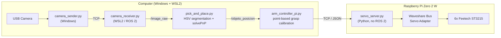

# SO-ARM100 Autonomous Pick-and-Place (Missing archives at the moment)

**Vision-guided autonomous pick-and-place system for the SO-ARM100 robotic arm**, built as a Bachelor's Thesis in Robotics Engineering (Universitat Jaume I). Distributed architecture: a PC handles computer vision and coordination over ROS 2, while a Raspberry Pi Zero 2 W performs embedded, real-time actuator control over UART — no ROS 2 required on the embedded side.


---

## Demo

https://github.com/user-attachments/assets/9b614d70-ec6b-4b7e-8448-ceca1e60122d

---

## Table of Contents

- [Overview](#overview)
- [Architecture](#architecture)
- [Key Engineering Challenges](#key-engineering-challenges)
- [Features](#features)
- [Repository Structure](#repository-structure)
- [Tech Stack](#tech-stack)
- [Getting Started](#getting-started)
- [Results](#results)
- [Roadmap](#roadmap)
- [Acknowledgments](#acknowledgments)
- [License](#license)

---

## Overview

The system detects an object on a workspace using computer vision, computes its real-world position via camera-robot calibration, and autonomously drives a 6-DOF SO-ARM100 arm through a full pick-and-place cycle — no manual intervention, no per-run tuning.

It started as a full digital twin in **ROS 2 + Gazebo + MoveIt2**, was transferred to physical hardware, and evolved into a **distributed embedded architecture**: vision and high-level coordination stay on a development PC, while a low-cost **Raspberry Pi Zero 2 W** takes over as a dedicated, real-time controller for the six servomotors — communicating over UART.

## Architecture



The split is deliberate: compute-heavy work (image processing, coordination) stays on the PC; the Pi is a dedicated, low-cost actuator controller — mirroring how real robotic systems separate perception from actuation. The TCP/JSON protocol between them waits for **physical arrival confirmation** (polling servo encoders) before advancing to the next step, instead of relying on fixed timing.

## Key Engineering Challenges

Two hardware issues shaped a large part of the development — worth a read if you like debugging stories:

**1. Wrist servo encoder wraparound.** The ST3215 servos use a 12-bit absolute encoder (0-4095) that wraps around at its boundary. On the wrist joint, that wraparound point happened to fall in the middle of the joint's working range, causing seemingly random behavior — the servo would refuse certain angles or spin the wrong way. Diagnosed by measuring the joint's real physical limits and **recentering the servo's home position** so the discontinuity falls outside the working range. Root-caused, not patched around.

**2. Silent UART failure via mode jumpers.** After wiring the Raspberry Pi to the Waveshare servo adapter, nothing responded — no errors, just silence. A loopback test on the Pi's UART port ruled out the Pi itself, narrowing the fault to the adapter's USB/UART mode jumpers, which were still set to USB mode. Flipping them fixed it instantly.

Full write-ups (with the encoder math) are in the thesis report — see [Acknowledgments](#acknowledgments).

## Features

- Real-time object detection via HSV color segmentation + image-moment centroid (sub-object precision, no GPU needed)
- Camera-robot extrinsic calibration via `solvePnP` against a checkerboard, with occlusion-tolerant pose caching
- **Point-based grasp calibration**: physically-validated grasp poses instead of live inverse kinematics — chosen deliberately for robustness on real (imperfect) hardware over on-paper precision
- Distributed control over a lightweight TCP/JSON protocol, with physical-arrival confirmation instead of fixed-time waits
- Full digital twin (Gazebo + MoveIt2) sharing the same control interface (`FollowJointTrajectory`) as the real robot

## Repository Structure

```
.
├── pc/
│   ├── vision/
│   │   ├── camera_sender.py       # Windows-side capture, streamed to WSL2 over TCP
│   │   ├── camera_receiver.py     # WSL2 / ROS 2 node, publishes /image_raw
│   │   └── pick_and_place.py      # Detection + camera-robot calibration (solvePnP, HSV)
│   ├── control/
│   │   ├── arm_controller_pi.py   # Coordinator: sequencing, grasp lookup, TCP client
│   │   └── calibrate_pick_pi.py   # Interactive point-based grasp calibration tool
│   └── so_arm_control/            # ROS 2 package: simulation, teleop, IK (digital twin)
├── raspberry_pi/
│   └── servo_server.py            # TCP/UART bridge, no ROS 2 dependency
├── calibration/
│   └── calib_points.example.json  # Sample calibrated grasp points
└── docs/
    └── media/                     # Demo GIF / screenshots
```

## Tech Stack

| Layer | Tools |
|---|---|
| Simulation | ROS 2 Jazzy, Gazebo Harmonic, MoveIt2, RViz2 |
| Vision | OpenCV (`solvePnP`, HSV segmentation, image moments) |
| Real-world control | Python (no ROS 2 at runtime), TCP sockets, UART |
| Embedded target | Raspberry Pi Zero 2 W, Raspberry Pi OS |
| Hardware | SO-ARM100 (6-DOF, 3D-printed), 6x Feetech ST3215, Waveshare Bus Servo Adapter |

## Getting Started

> These scripts assume the physical setup described in the thesis (camera position, checkerboard-based calibration). Treat this as a reference implementation rather than a drop-in package.

```bash
# 1. On the Raspberry Pi — start the servo server
ssh <user>@<raspberry-pi-host>
python3 servo_server.py

# 2. On Windows — start the camera capture
python camera_sender.py

# 3. On the PC (WSL2) — vision + control, in order
python3 camera_receiver.py
python3 pick_and_place.py
python3 arm_controller_pi.py
```

To (re)calibrate grasp points after moving the camera, arm, or checkerboard:

```bash
python3 calibrate_pick_pi.py
```

## Results

- Autonomous pick-and-place cycle: detection &rarr; approach &rarr; grasp &rarr; transfer &rarr; release &rarr; return to home
- Reliable grasping across the whole calibrated workspace, validated over numerous manual trials (no formal statistical benchmark yet — see [Roadmap](#roadmap))
- Fully embedded actuator control on a $20-class single-board computer, with no ROS 2 dependency at runtime

## Roadmap

- [ ] Voice command interface (Vosk / Whisper), feeding into the existing `arm_controller`
- [ ] Multi-object generalization via a lightweight neural detector (YOLO)
- [ ] Visual servoing to reduce dependency on point calibration
- [ ] 3D workspace support (variable height, non-planar surfaces)
- [ ] Formal quantitative success-rate benchmark

## Acknowledgments

Built on the open-source [SO-ARM100](https://github.com/TheRobotStudio/SO-ARM100) hardware platform by TheRobotStudio (Apache-2.0 license). Developed as a Bachelor's Thesis in Robotics Engineering at Universitat Jaume I, supervised by Óscar Belmonte Fernández.

## License

This project's original source code is released under the [MIT License](LICENSE). Hardware design files (STL/STEP) remain under the upstream SO-ARM100 Apache-2.0 license — see their repository for details.
